# Admin Use Case Diagram - Optifi Financial Tracking System

## Overview

This document outlines the admin use cases for the Optifi financial tracking system, covering user management, system analytics, security, content management, and technical administration.

## Use Case Diagram

```mermaid
graph TB
    %% Actors
    Admin((Admin))

    %% User Management Package
    subgraph "User Management"
        UM1[Manage Users]
        UM2[Assign User Roles]
        UM3[Activate/Deactivate Users]
        UM4[View User Analytics]
        UM5[Monitor User Activity]
    end

    %% System Analytics Package
    subgraph "System Analytics & Monitoring"
        SA1[Dashboard Overview]
        SA2[User Statistics]
        SA3[Financial Analytics]
        SA4[System Performance]
        SA5[Generate Reports]
    end

    %% Security & Compliance Package
    subgraph "Security & Compliance"
        SC1[Data Privacy Management]
        SC2[Audit Logs]
        SC3[Security Monitoring]
        SC4[Backup Management]
        SC5[GDPR Compliance]
    end

    %% Content & Configuration Package
    subgraph "Content & Configuration"
        CC1[System Settings]
        CC2[Feature Flags]
        CC3[Notification Management]
        CC4[Help & Support]
        CC5[FAQ Management]
    end

    %% Financial Oversight Package
    subgraph "Financial Oversight"
        FO1[Transaction Monitoring]
        FO2[Budget Templates]
        FO3[Category Management]
        FO4[Financial Reports]
        FO5[Fraud Detection]
    end

    %% Technical Administration Package
    subgraph "Technical Administration"
        TA1[Database Management]
        TA2[API Management]
        TA3[Error Logs]
        TA4[Maintenance Mode]
        TA5[System Updates]
    end

    %% User Experience Management Package
    subgraph "User Experience Management"
        UX1[Feedback Management]
        UX2[Feature Requests]
        UX3[A/B Testing]
        UX4[Onboarding Configuration]
        UX5[User Surveys]
    end

    %% OCR & Receipt Management Package
    subgraph "OCR & Receipt Management"
        OR1[OCR Processing Monitoring]
        OR2[Receipt Data Validation]
        OR3[OCR Accuracy Reports]
        OR4[Receipt Template Management]
        OR5[OCR Error Handling]
    end

    %% Connections
    Admin --> UM1
    Admin --> UM2
    Admin --> UM3
    Admin --> UM4
    Admin --> UM5

    Admin --> SA1
    Admin --> SA2
    Admin --> SA3
    Admin --> SA4
    Admin --> SA5

    Admin --> SC1
    Admin --> SC2
    Admin --> SC3
    Admin --> SC4
    Admin --> SC5

    Admin --> CC1
    Admin --> CC2
    Admin --> CC3
    Admin --> CC4
    Admin --> CC5

    Admin --> FO1
    Admin --> FO2
    Admin --> FO3
    Admin --> FO4
    Admin --> FO5

    Admin --> TA1
    Admin --> TA2
    Admin --> TA3
    Admin --> TA4
    Admin --> TA5

    Admin --> UX1
    Admin --> UX2
    Admin --> UX3
    Admin --> UX4
    Admin --> UX5

    Admin --> OR1
    Admin --> OR2
    Admin --> OR3
    Admin --> OR4
    Admin --> OR5
```

## Detailed Use Case Descriptions

### 1. User Management

#### 1.1 Manage Users

- **Description**: Admin can view, create, edit, and delete user accounts
- **Actors**: Admin
- **Preconditions**: Admin is logged in with appropriate permissions
- **Main Flow**:
  1. Admin accesses user management dashboard
  2. Admin views list of all users with search/filter options
  3. Admin can create new user accounts
  4. Admin can edit existing user information
  5. Admin can deactivate/delete user accounts
- **Postconditions**: User accounts are updated in the system

#### 1.2 Assign User Roles

- **Description**: Admin can assign or change user roles (user, admin, premium)
- **Actors**: Admin
- **Main Flow**:
  1. Admin selects a user from the user list
  2. Admin views current role assignment
  3. Admin selects new role from dropdown
  4. System validates role change permissions
  5. Role is updated and user is notified

#### 1.3 Monitor User Activity

- **Description**: Admin can view detailed user activity logs and analytics
- **Actors**: Admin
- **Main Flow**:
  1. Admin accesses activity monitoring dashboard
  2. Admin views login history, feature usage, and session data
  3. Admin can filter by date range, user, or activity type
  4. Admin can export activity reports

### 2. System Analytics & Monitoring

#### 2.1 Dashboard Overview

- **Description**: Admin can view comprehensive system-wide metrics and KPIs
- **Actors**: Admin
- **Main Flow**:
  1. Admin accesses admin dashboard
  2. System displays real-time metrics (users, transactions, revenue)
  3. Admin can view charts and graphs of key performance indicators
  4. Admin can drill down into specific metrics

#### 2.2 Financial Analytics

- **Description**: Admin can view aggregated financial data across all users
- **Actors**: Admin
- **Main Flow**:
  1. Admin accesses financial analytics section
  2. System displays total expenses, income, and budget data
  3. Admin can view spending patterns and trends
  4. Admin can generate financial reports

### 3. Security & Compliance

#### 3.1 Data Privacy Management

- **Description**: Admin manages user data privacy settings and GDPR compliance
- **Actors**: Admin
- **Main Flow**:
  1. Admin accesses privacy management dashboard
  2. Admin configures data retention policies
  3. Admin manages user consent settings
  4. Admin handles data deletion requests

#### 3.2 Audit Logs

- **Description**: Admin can view system access logs and user activity trails
- **Actors**: Admin
- **Main Flow**:
  1. Admin accesses audit log system
  2. Admin views detailed logs of all system activities
  3. Admin can filter logs by user, action, or time period
  4. Admin can export audit reports for compliance

### 4. Financial Oversight

#### 4.1 Transaction Monitoring

- **Description**: Admin can review flagged or suspicious transactions
- **Actors**: Admin
- **Main Flow**:
  1. Admin accesses transaction monitoring dashboard
  2. System displays flagged transactions based on rules
  3. Admin reviews transaction details and user information
  4. Admin can approve, reject, or investigate transactions

#### 4.2 Category Management

- **Description**: Admin manages expense/income categories system-wide
- **Actors**: Admin
- **Main Flow**:
  1. Admin accesses category management section
  2. Admin can create, edit, or delete categories
  3. Admin can set category rules and defaults
  4. Admin can merge or reorganize categories

### 5. OCR & Receipt Management

#### 5.1 OCR Processing Monitoring

- **Description**: Admin monitors OCR processing performance and accuracy
- **Actors**: Admin
- **Main Flow**:
  1. Admin accesses OCR monitoring dashboard
  2. Admin views processing statistics and success rates
  3. Admin monitors processing queue and performance metrics
  4. Admin can adjust OCR settings and parameters

#### 5.2 Receipt Data Validation

- **Description**: Admin can review and validate extracted receipt data
- **Actors**: Admin
- **Main Flow**:
  1. Admin accesses receipt validation interface
  2. Admin reviews flagged or uncertain OCR results
  3. Admin can manually correct or approve extracted data
  4. Admin can provide feedback to improve OCR accuracy

### 6. Technical Administration

#### 6.1 Database Management

- **Description**: Admin monitors database performance and storage
- **Actors**: Admin
- **Main Flow**:
  1. Admin accesses database management dashboard
  2. Admin monitors database performance metrics
  3. Admin can optimize queries and indexes
  4. Admin manages database backups and recovery

#### 6.2 Maintenance Mode

- **Description**: Admin can enable/disable maintenance mode for system updates
- **Actors**: Admin
- **Main Flow**:
  1. Admin accesses system settings
  2. Admin enables maintenance mode with custom message
  3. System displays maintenance page to users
  4. Admin performs system updates
  5. Admin disables maintenance mode

### 7. User Experience Management

#### 7.1 Feedback Management

- **Description**: Admin reviews and responds to user feedback
- **Actors**: Admin
- **Main Flow**:
  1. Admin accesses feedback management system
  2. Admin reviews user feedback and suggestions
  3. Admin can categorize and prioritize feedback
  4. Admin can respond to users and track resolution

#### 7.2 A/B Testing

- **Description**: Admin manages feature testing and user experience experiments
- **Actors**: Admin
- **Main Flow**:
  1. Admin creates A/B test configurations
  2. Admin sets test parameters and user groups
  3. Admin monitors test performance and metrics
  4. Admin analyzes results and implements changes

## Priority Matrix

| Use Case                  | Priority | Complexity | Business Value |
| ------------------------- | -------- | ---------- | -------------- |
| Manage Users              | High     | Medium     | High           |
| Dashboard Overview        | High     | Low        | High           |
| Transaction Monitoring    | High     | High       | Critical       |
| Security Monitoring       | Critical | High       | Critical       |
| OCR Processing Monitoring | Medium   | Medium     | Medium         |
| Feedback Management       | Medium   | Low        | Medium         |
| System Settings           | Low      | Low        | Medium         |
| A/B Testing               | Low      | High       | Low            |

## Implementation Recommendations

### Phase 1 (Critical)

1. **User Management** - Basic CRUD operations for users
2. **Dashboard Overview** - Essential metrics and KPIs
3. **Security Monitoring** - Basic audit logs and security alerts

### Phase 2 (High Priority)

1. **Transaction Monitoring** - Fraud detection and transaction review
2. **OCR Processing Monitoring** - Receipt processing oversight
3. **Financial Analytics** - System-wide financial insights

### Phase 3 (Medium Priority)

1. **Feedback Management** - User feedback system
2. **Category Management** - Expense category administration
3. **System Settings** - Configuration management

### Phase 4 (Low Priority)

1. **A/B Testing** - Advanced user experience optimization
2. **Advanced Analytics** - Deep-dive reporting features
3. **API Management** - Developer tools and API monitoring
